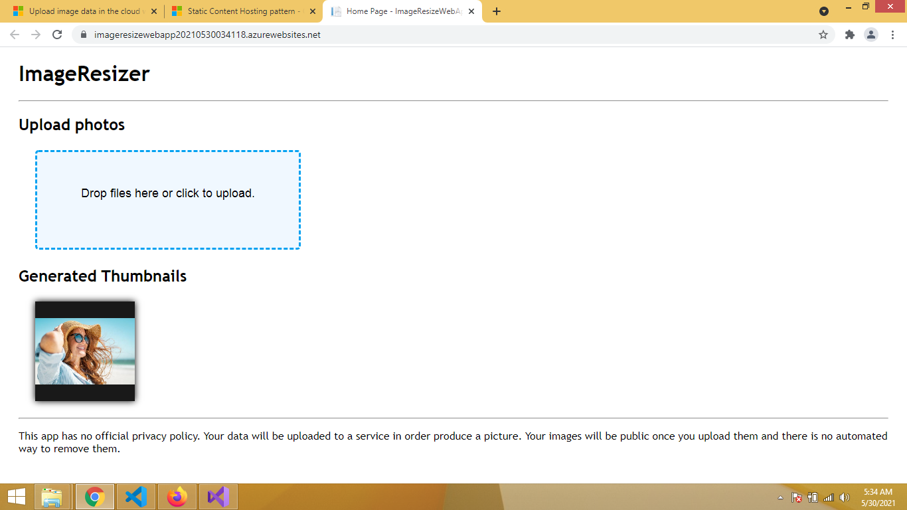

# Stataic Content Hosting Pattern

This pattern suggests to host static content of a Web Application to Azure Storage services so that we can save Application processing.

For this we have images in Application that are static and can be saved and retrieved from Azure Storage Account. While the Application is deployed at Azure App Services. 

## Example
In this example, we have a simple ASP.Net Core Application deployed on Azure App Service. We created a Storage Account that will be hosting all the static content. 

This application Uploads images at Azure Storage Blob Container, and displays all the images at Blob Container in form of a carousel. 
This carousel automatically fetches the recently uploaded images without reloading the page. 

[Credits/References](https://docs.microsoft.com/en-us/azure/storage/blobs/storage-upload-process-images?tabs=dotnet)